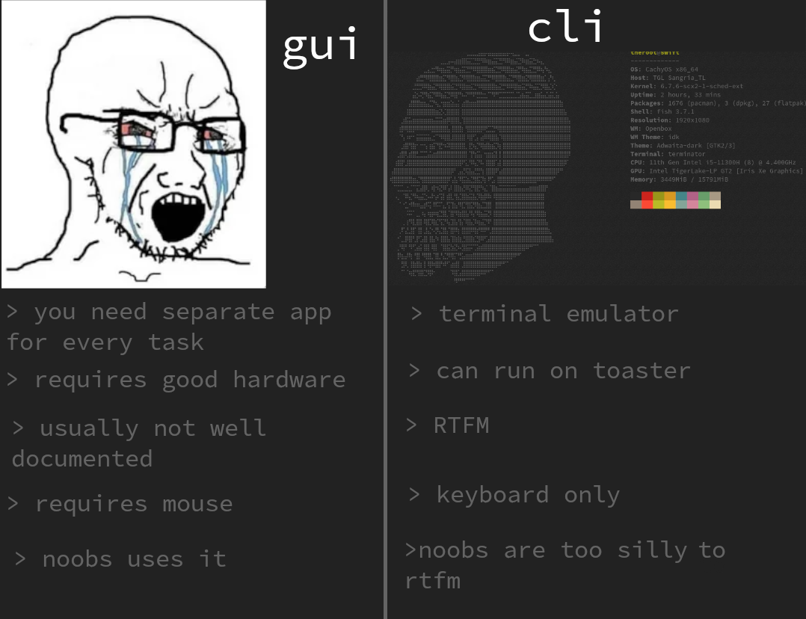
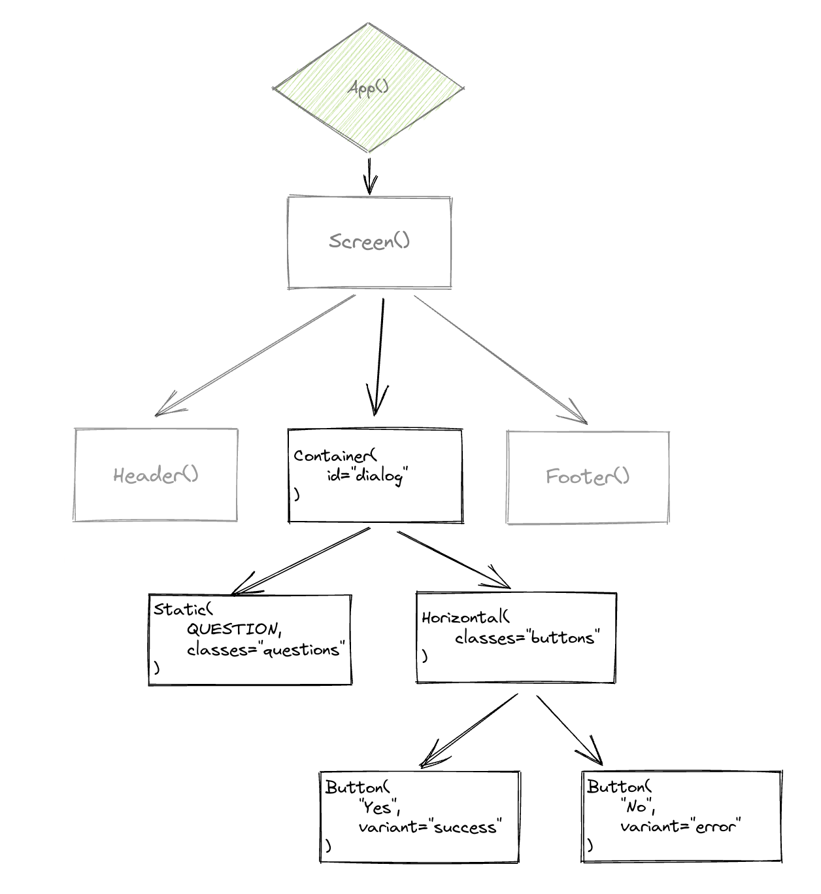

# Building TUIs in Python
Lunar Python guild session

---

# CLIs and GUIs



---


# TUIs


---

# Textualize

Textual is a framework to build TUIs in Python.

Features:
- easy
- fast
- efficient
- open source
- cross platform
- pretty

---

# Examples - *tui-network*


---

# Examples - *harlequin*


---

# Examples - *upiano*


---

# A simple markdown editor

````python
from textual.app import App, ComposeResult
from textual.containers import HorizontalScroll
from textual.widgets import Footer, TextArea

from tui_notes.widgets.files import FilesWidget
from tui_notes.widgets.note import NoteWidget
from tui_notes.widgets.assistant import AssistantWidget


class NotesApp(App):

    BORDER_TITLE = 'Notes app'
    CSS_PATH = "static/style.tcss"
    BINDINGS = {
        ("ctrl+shift+s", "save_note", "Save note"),
        ("ctrl+shift+w", "close_note", "Close note"),
    }

    def compose(self) -> ComposeResult:
        with HorizontalScroll(id='main_view'):
            yield FilesWidget(can_focus=False)
            yield NoteWidget(can_focus=False)
        yield AssistantWidget()
        yield Footer()

    def action_save_note(self) -> None:
        with open(self.app.query_one(NoteWidget).note_path, 'w') as file:
            file.write(self.query_one(TextArea).text)

    def action_close_note(self) -> None:
        self.query_one(TextArea).clear()
        self.query_one(NoteWidget).note_path = None

app = NotesApp()
app.run()   
````

---

# A simple markdown editor

````python
from textual.app import App, ComposeResult
from textual.containers import HorizontalScroll
from textual.widgets import Footer, TextArea

from tui_notes.widgets.files import FilesWidget
from tui_notes.widgets.note import NoteWidget
from tui_notes.widgets.assistant import AssistantWidget


class NotesApp(App): # --> Extend App class

    CSS_PATH = "static/style.tcss" # --> Define style css
    BINDINGS = {
        ("ctrl+shift+s", "save_note", "Save note"),
        ("ctrl+shift+w", "close_note", "Close note"),
    } # --> Define global keybindings

    def compose(self) -> ComposeResult: # --> Standard method to mount widgets
        with HorizontalScroll(id='main_view'):
            yield FilesWidget(can_focus=False)
            yield NoteWidget(can_focus=False)
        yield AssistantWidget()
        yield Footer()

    def action_save_note(self) -> None: # --> Define what happens when you press keybindings
        with open(self.app.query_one(NoteWidget).note_path, 'w') as file: # --> DOM query on app
            file.write(self.query_one(TextArea).text) # --> DOM query

    def action_close_note(self) -> None:
        self.query_one(TextArea).clear()
        self.query_one(NoteWidget).note_path = None

app = NotesApp()
app.run()   
````

---

# DOM queries



---

# A custom widget

````python
class FilesWidget(VerticalScroll):

    BORDER_TITLE = 'Files'

    def compose(self) -> ComposeResult:
        yield DirectoryTree('~/Desktop/')

    def on_directory_tree_file_selected(self, message: DirectoryTree.FileSelected):
        if str(message.path).endswith('.md'):
            with open(message.path) as f:
                self.app.query_one(NoteWidget).note_path = str(message.path)
                self.app.query_one(TextArea).load_text(f.read())
````

---

# A custom widget

````python
class FilesWidget(VerticalScroll):

    BORDER_TITLE = 'Files'

    def compose(self) -> ComposeResult:
        yield DirectoryTree('~/Desktop/')

    def on_directory_tree_file_selected(self, message: DirectoryTree.FileSelected): # --> Ran every time app state changes
        if str(message.path).endswith('.md'):
            with open(message.path) as f:
                self.app.query_one(NoteWidget).note_path = str(message.path)
                self.app.query_one(TextArea).load_text(f.read())
````