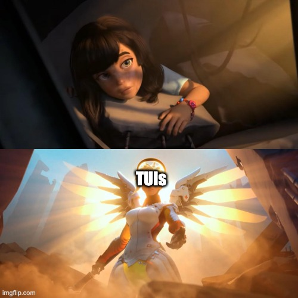

# TUIs in Python

---

# CLIs and GUIs

---

# TUIs: the middleground

---

# Textualize

Textual is a framework to build TUIs in Python.

Features:
- easy
- fast
- efficient
- open source
- cross platform
- pretty

---

# Examples - *tui-network*

---

# Examples - *harlequin*

---

# Examples - *upiano*

